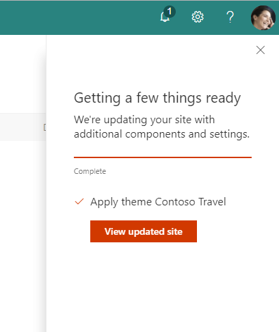

# Applying custom theme

## Summary
You can use a site script to apply a company theme to a modern site. The following example uses the applyTheme action to set a pre-loaded company theme after site creation. This action requires simply referencing a company theme name, so one must be first installed to your tenant gallery. For more details on this check out https://aka.ms/spsitetheming - and if you need help creating a theme be sure to check out the theme generator at https://aka.ms/spthemebuilder. 



## Sample

Solution|Author(s)
--------|---------
site-apply-company-theme | SharePoint Team

## Version history

Version|Date|Comments
-------|----|--------
1.0|December 14, 2017|Initial release

## Disclaimer
**THIS CODE IS PROVIDED *AS IS* WITHOUT WARRANTY OF ANY KIND, EITHER EXPRESS OR IMPLIED, INCLUDING ANY IMPLIED WARRANTIES OF FITNESS FOR A PARTICULAR PURPOSE, MERCHANTABILITY, OR NON-INFRINGEMENT.**

---

## Additional notes

Here is a sample theme you can use to try this out:

```json
$ContosoThemeSample=
@{
"themePrimary" = "#3ad600";
"themeLighterAlt" = "#f4fff0";
"themeLighter" = "#e9ffe1";
"themeLight" = "#d4ffc4";
"themeTertiary" = "#a4ff83";
"themeSecondary" = "#41f400";
"themeDarkAlt" = "#33c100";
"themeDark" = "#289600";
"themeDarker" = "#1f7600";
"neutralLighterAlt" = "#ececec";
"neutralLighter" = "#e8e8e8";
"neutralLight" = "#dedede";
"neutralQuaternaryAlt" = "#cfcfcf";
"neutralQuaternary" = "#c6c6c6";
"neutralTertiaryAlt" = "#bebebe";
"neutralTertiary" = "#d6d6d6";
"neutralSecondary" = "#474747";
"neutralPrimaryAlt" = "#2e2e2e";
"neutralPrimary" = "#333333";
"neutralDark" = "#242424";
"black" = "#1c1c1c";
"white" = "#f1f1f1";
"primaryBackground" = "#f1f1f1";
"primaryText" = "#333333";
"bodyBackground" = "#f1f1f1";
"bodyText" = "#333333";
"disabledBackground" = "#e8e8e8";
"disabledText" = "#bebebe";
"accent" = "#0072d6"
}
```

You can apply using the following PowerShell command:

```ps
Add-SPOTheme -Name "Company Theme Sample" -Palette $ContosoThemeSample -IsInverted $false
```

And then reference in your site script JSON:

```json
var applyCompanyTheme = 
{
    "$schema": "schema.json",
        "actions": [
            {
                "verb": "applyTheme",
                themeName: "Company Theme Sample"
            }
        ],
            "bindata": { },
    "version": 1
};
```

You can create a site script with this action using REST or PowerShell - and then reference the returned <SiteScriptId> in a site design, using either web template 64 (group-connected team) or 68 (communication).

This sample is covered in the main documentation aroud Site Designs and Site Scripts.

- [SharePoint site design and site script overview](https://docs.microsoft.com/en-us/sharepoint/dev/declarative-customization/site-design-overview)


